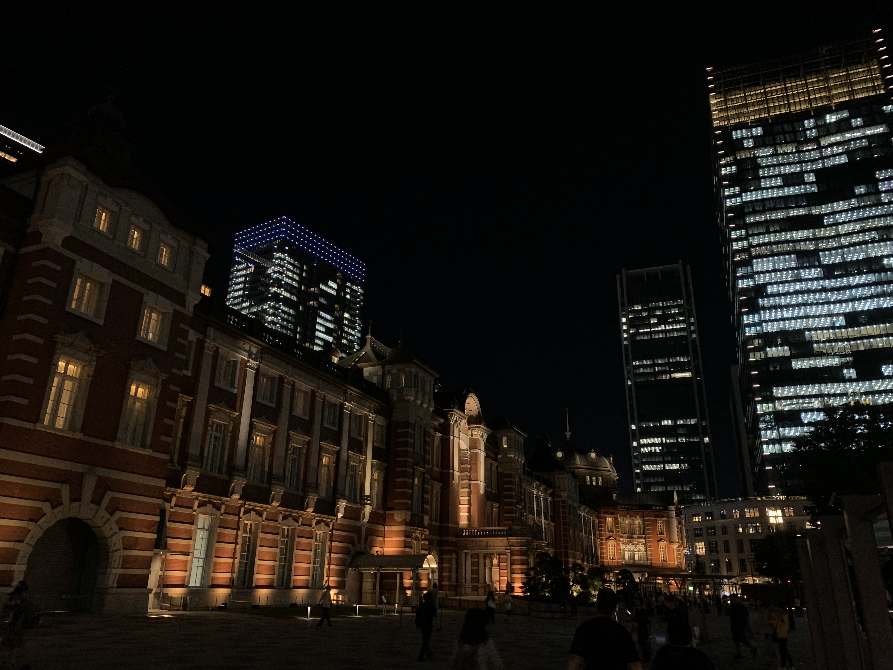
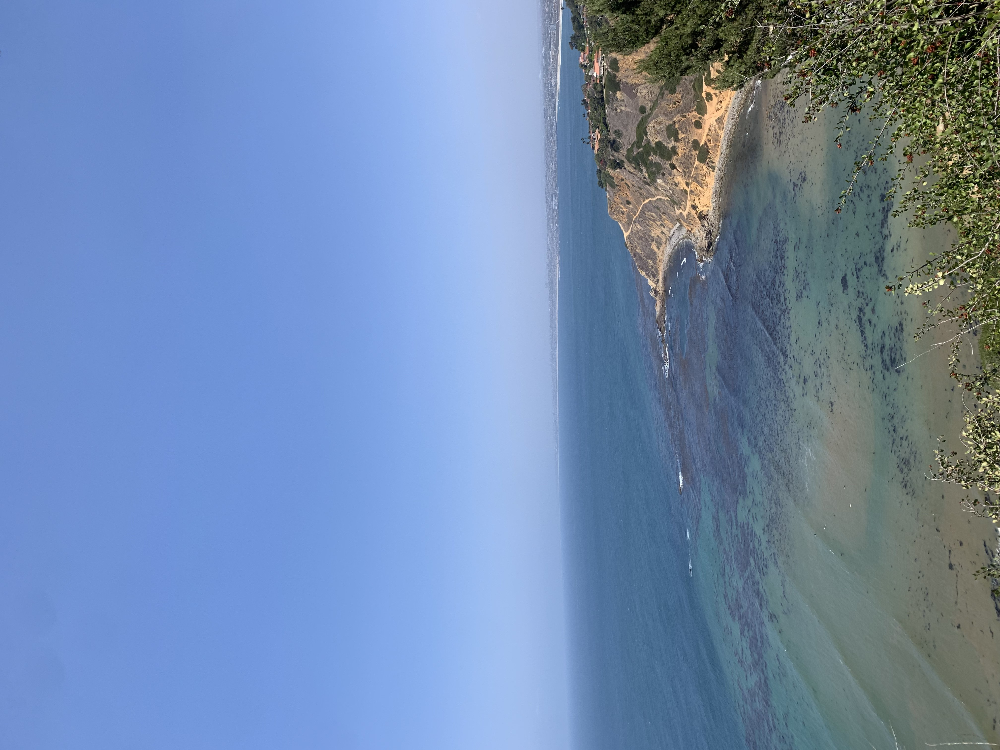
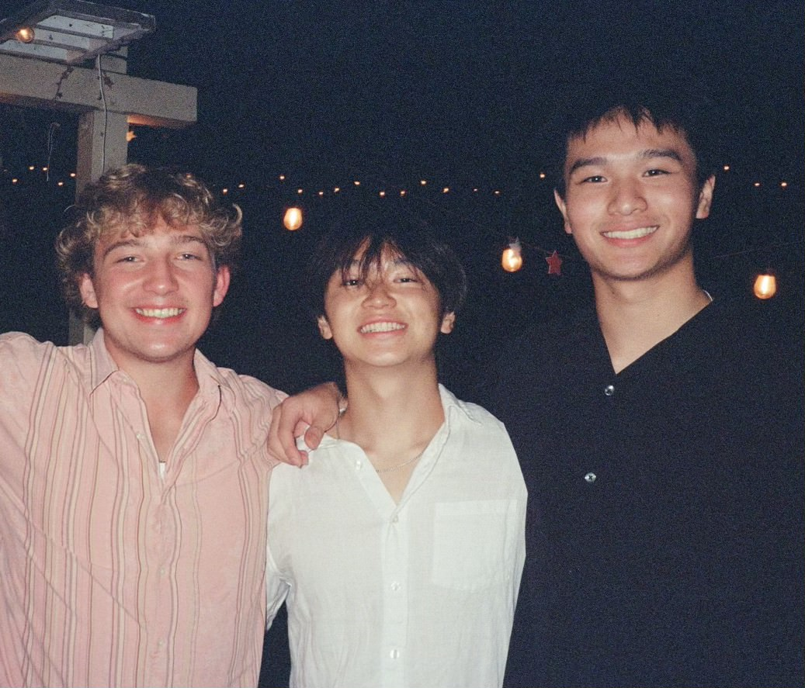
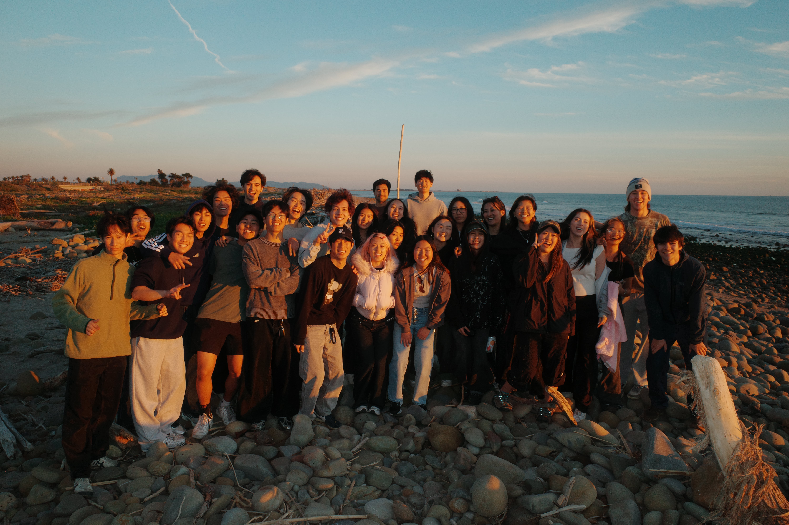
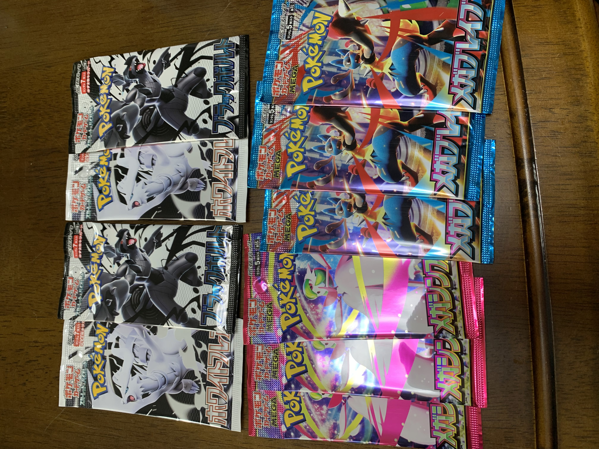
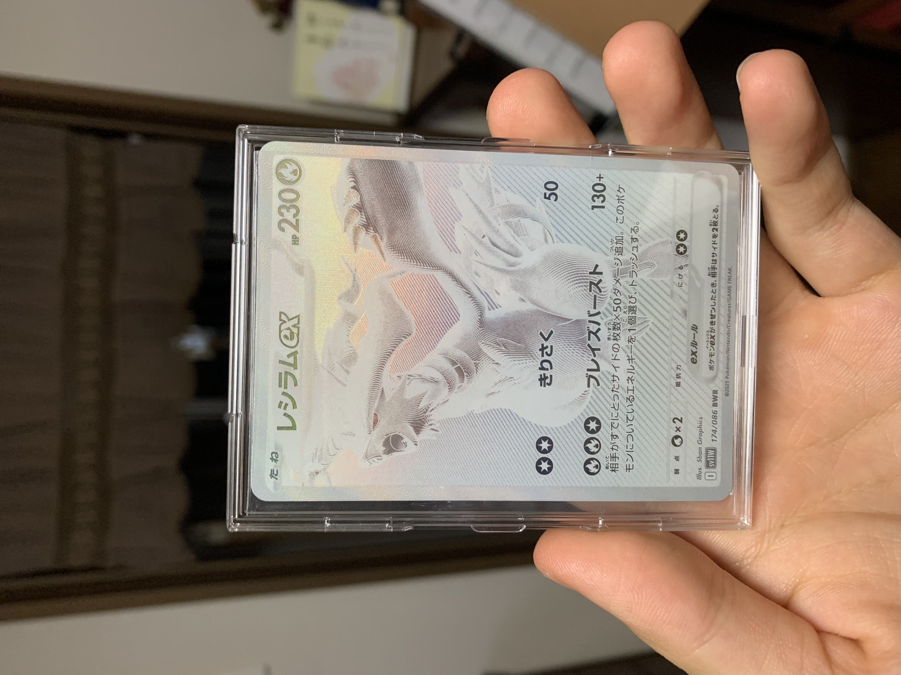

## Home

I'm originally from Japan, moving to the US in 2016. I've grown in both Tokyo and Los Angeles, California. It was a big change relocating overseas, but I'm grateful for being able to experience lives in both countries.

  <figure class="photo-card">
    
    <figcaption>Tokyo</figcaption>
  </figure>

  <figure class="photo-card">
    
    <figcaption>Palos Verdes, California</figcaption>
  </figure>

## Personal Life

Outside of school, I mainly like to spend time with my friends and being active! My favorite sports are soccer, basketball, and volleyball!

  <figure class="photo-card">
    
    <figcaption>Freshman Roommates</figcaption>
  </figure>

  <figure class="photo-card">
    
    <figcaption>Nikkei Student Union club group picture</figcaption>
  </figure>
  
  <figure class="photo-card">
    
    <figcaption>Hometown Friends</figcaption>
  </figure>

## Hobbies

I've had a crazy obsession for pokemon cards since I was young, and I've recently resumed collecting them. My other hobbies include playing the piano and watching movies/anime. My favorite recent watch was *Whiplash.*

  <figure class="photo-card">
    
    <figcaption>Pokemon Card Obsession</figcaption>
  </figure>

  <figure class="photo-card">
    
    <figcaption>Best Card!</figcaption>
  </figure>

