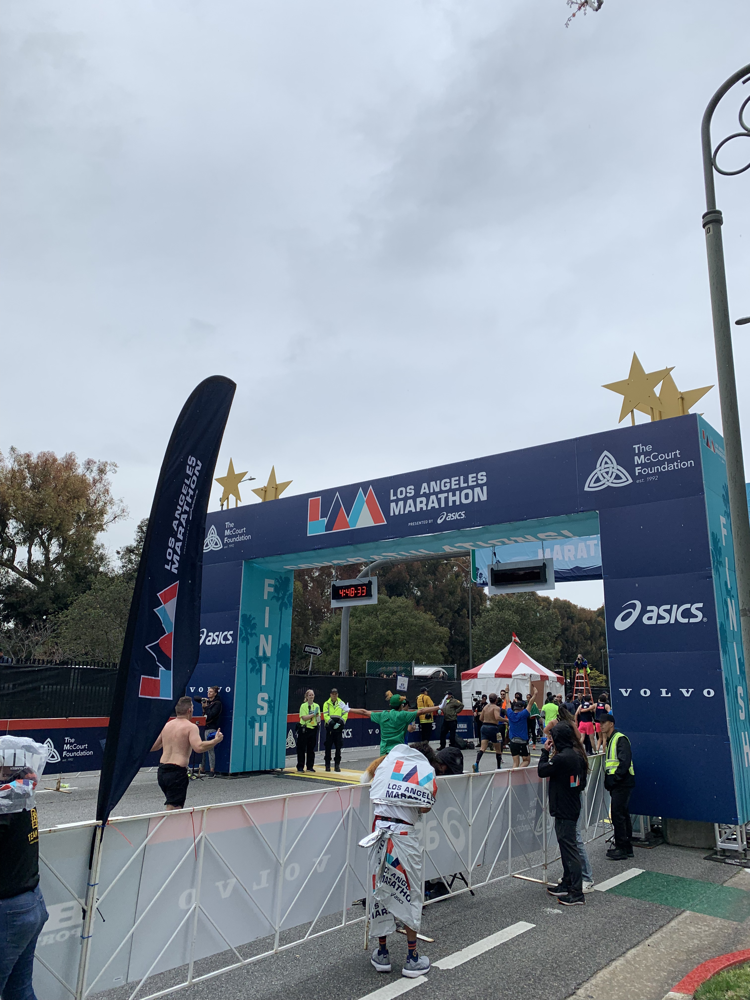
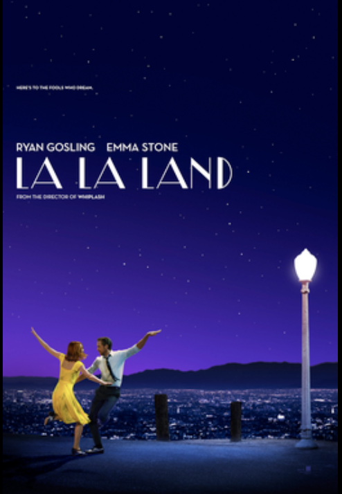
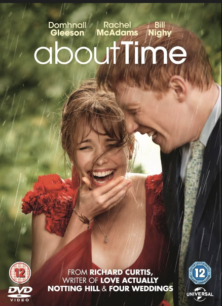

## Home

I’m originally from Japan and moved to the United States in 2016. Having grown up in both Tokyo and Los Angeles, I feel like my background has been shaped by two very different but equally meaningful places. Moving overseas was a major transition, and at the time it felt both exciting and overwhelming. Looking back, though, I’m really grateful for that experience. Living in both countries has given me a broader perspective and has shaped the way I connect with people, adapt to new environments, and see the world.

  <figure class="photo-card">
    
    <figcaption>Tokyo</figcaption>
  </figure>

  <figure class="photo-card">
    
    <figcaption>California</figcaption>
  </figure>

## Personal Life

Outside of school, I love spending time with my friends and staying active. Some of my favorite sports are soccer, basketball, and volleyball, and I enjoy both the competitive and social side of playing. At UCSB, I’m involved in multiple intramural sports teams, which has been a fun way to stay engaged in sports and meet new people (My 2 favorite things!). I also previously ran the LA Marathon, which was a really rewarding experience that pushed me both physically and mentally.

  <figure class="photo-card">
    
    <figcaption>Freshman Roommates</figcaption>
  </figure>

  <figure class="photo-card">
    
    <figcaption>Nikkei Student Union club group picture</figcaption>
  </figure>
  
  <figure class="photo-card">
    
    <figcaption>Hometown Friends</figcaption>
  </figure>
  
  <figure class="photo-card">
    
    <figcaption>LA Marathon</figcaption>
  </figure>

## Hobbies

I’ve had a longtime obsession with Pokémon cards ever since I was young, and recently I’ve started collecting them again. It’s a hobby that feels nostalgic, and I’ve really enjoyed getting back into it. Outside of that, I also love playing the piano and spending time watching movies and anime. Two of my favorite movies are *La La Land* and *About Time*. Follow my Letterboxd!: Harambananabee

  <figure class="photo-card">
    
    <figcaption>Pokemon Card Obsession</figcaption>
  </figure>

  <figure class="photo-card">
    
    <figcaption>Best Card!</figcaption>
  </figure>
  
  <figure class="photo-card">
    
    <figcaption>La La Land</figcaption>
  </figure>
  
  <figure class="photo-card">
    
    <figcaption>About Time</figcaption>
  </figure>

